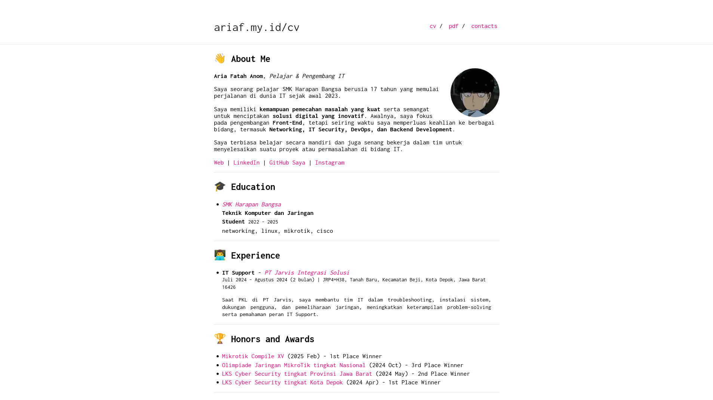

# Aria Fatah - CV

<a href="https://jekyll-themes.com/ariafatah0711/cv">
  
</a>

[](https://ariaf.my.id/cv)

## 📌 Tentang
Repositori ini berisi CV yang dibuat menggunakan Jekyll. Template awal berasal dari [heartsker/resume](https://github.com/heartsker/resume) dan telah dimodifikasi sesuai kebutuhan.



## 🚀 Menjalankan Secara Lokal
Pastikan Jekyll sudah terinstal di sistem. Jika belum, bisa mengikuti panduan instalasi di [Jekyll Docs](https://jekyllrb.com/docs/installation/).

Jalankan perintah berikut untuk menjalankan server lokal:
```bash
jekyll serve
```
Atau dengan port dan host khusus:
```bash
jekyll serve --host 0.0.0.0 --port 4000
```

## ⚙️ Konfigurasi  
Pengaturan utama berada di file `_config.yml`. Beberapa opsi yang dapat disesuaikan:  

```yaml
title: ariaf.my.id
title_path: ariaf.my.id/cv
url: "https://ariaf.my.id"
baseurl: "/cv"
```  

- **`title` atau `title_path`**: Pilih salah satu sesuai kebutuhan.  
- **`url` dan `baseurl`**: Sesuaikan jika ingin mengubah path dasar situs.  
- **Navigasi & footer**: Dapat disesuaikan sesuai preferensi.  

---

## 📊 Data  
Informasi dalam CV dapat diperbarui melalui file di dalam folder `_data/`, seperti:  

- **`education.yml`** → Data pendidikan  
- **`certifications.yml`** → Sertifikasi yang diperoleh  
- **`experience.yml`** → Pengalaman kerja atau magang  
- **`honors.yml`** → Penghargaan atau kompetisi  
- **`skills.yml`** → Keterampilan & keahlian  

### Contoh Struktur Data  

#### `_data/certifications.yml`  
```yaml
certifications:
  - name: IDCamp Front-End Developer Mahir
    path: cert/FE - IDCamp Mahir-14.pdf
    year: "2023"
    subcerts:
      - name: Belajar Dasar Pemrograman Web
        path: cert/dicoding/fe1_Belajar%20Dasar%20Pemrograman%20Web.pdf
        year: "2024 - 2027"
```

#### `_data/education.yml`  
```yaml
educations:
  - school: "SMK Harapan Bangsa"
    link: "https://www.smkharapanbangsa.sch.id/"
    degree: "Student"
    duration: "2022 - 2025 (perkiraan)"
    major: "Teknik Komputer dan Jaringan"
    specialization: "Networking, Linux, MikroTik, Cisco"
```

#### `_data/experience.yml`  
```yaml
experiences:
  - title: IT Support
    company: PT Jarvis Integrasi Solusi
    link: https://www.linkedin.com/company/jarvis-integrasi-solusi/
    duration: Juli 2024 - Agustus 2024 (2 bulan)
    location: JRP4+H38, Tanah Baru, Kecamatan Beji, Kota Depok, Jawa Barat 16426
    description: |
      Selama PKL di PT Jarvis, saya membantu tim IT dalam troubleshooting, instalasi sistem, dukungan pengguna, dan pemeliharaan jaringan.  
      Pengalaman ini meningkatkan keterampilan problem-solving dan pemahaman peran IT Support.
```

#### `_data/honors.yml`  
```yaml
honors:
  - name: Olimpiade Jaringan MikroTik tingkat Nasional
    path: cert/lomba/3_ojm_2024.jpg
    date: 2024 Oct
    rank: 3rd Place Winner
```

#### `_data/skills.yml`  
```yaml
skills:
  networking:
    - name: Cisco
      level: "■■■□□"
      description: Intermediate
    - name: MikroTik
      level: "■■■■□"
      description: Advanced
```

---

## 📄 Konfigurasi `index.md` & `pdf.md`  

- **`index.md`** → Halaman CV utama dengan tampilan langsung (embed).  
- **`pdf.md`** → Halaman CV yang hanya berisi daftar tautan (tanpa embed).  

### **Contoh Penggunaan:**  
```liquid
# Dengan tampilan embed



# Hanya menampilkan link (tanpa embed)


```

---

## 🛠️ Konversi ke PDF (Opsional)
### 👅 Install Chromium untuk Playwright
```bash
playwright install chromium
```

### 🖨️ Konversi Halaman ke PDF
#### 🔹 **Lokal (Tidak Disarankan)**
> Menggunakan localhost bisa menyebabkan masalah dengan path atau asset yang tidak termuat dengan benar.
```bash
playwright pdf http://localhost:4000/cv/pdf.html resume.pdf
```

#### 🔹 **Setelah Deploy (Direkomendasikan)**
> Pastikan website sudah online sebelum menjalankan perintah ini.
```bash
playwright pdf https://ariaf.my.id/cv/pdf.html resume.pdf
```

## 📄 Lisensi
Proyek ini menggunakan [MIT License](https://github.com/heartsker/resume/blob/gh-pages/LICENSE).
